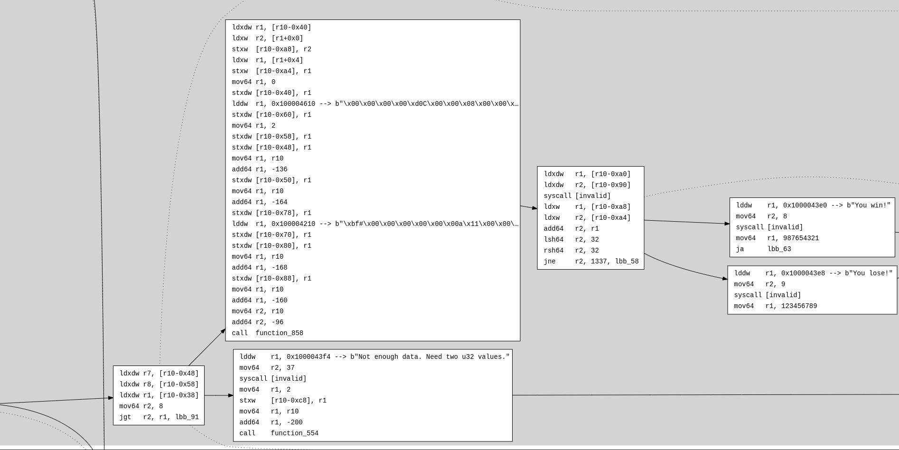
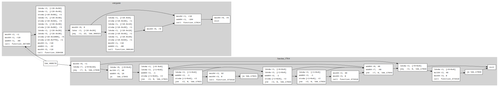

# sol-azy

**sol-azy** is a modular CLI toolchain for static analysis and reverse engineering of Solana sBPF programs.  
It supports disassembly, control flow analysis, and custom Starlark-based rule evaluation.

## Features

- Compile Solana programs (Anchor or native SBF)
- Perform static AST-based security analysis with Starlark rules
- Reverse-engineer `.so` bytecode: disassembly (& rust equivalences), control flow graphs, and immediate value decoding
- Modular CFG editing (`dotting`)
- On-chain binary or raw AccountInfo retrieval (`fetcher`)

## Getting Started

### Prerequisites

- [Rust + Cargo](https://www.rust-lang.org/tools/install)
- (only for Build command)[ Solana CLI](https://docs.solana.com/cli/install-solana-cli-tools)
- (Optional) [Anchor](https://www.anchor-lang.com/) for Anchor-based projects

### Installation

```bash
git clone https://github.com/your-org/sol-azy.git
cd sol-azy
cargo build --release
````

Or for development:

```bash
cargo run -- <command> [options]
```

## Usage

Here are some basic examples. See [docs](https://fuzzinglabs.github.io/sol-azy/introduction.html) for full documentation.

### Build a project

```bash
cargo run -- build --target-dir ./my_project --out-dir ./out/
```

### Run static analysis

```bash
cargo run -- sast --target-dir ./my_project --rules-dir ./rules/
```

> HIGHLY RECOMMENDED: Using the --release is wayyyyy faster, so if you don’t need debug logs, I’d recommend using it


### Reverse engineer a compiled `.so`

```bash
cargo run -- reverse --mode both --out-dir ./out --bytecodes-file ./program.so --labeling --reduced
```

Result in `immediate_data_table`, `disassembly.out` and `cfg.dot` (converted to svg):

```
0x100000000 (+ 0x0): b"\x7fELF\x02\x01\x01\x00\x00\x00\x00\x00\x00\x00\x00\x00\x03\x00\xf7\x00\x01\x00\x00\x008\x01\x00\x00\x00\x00\x00\x00@\x00\x00\x00\x00\x00\x [...SNIP...]"
0x100000120 (+ 0x120): b"y\x11\x00\x00\x00\x00\x00\x00\x85\x10\x00\x00#\x04\x00\x00\x95\x00\x00\x00\x00\x00\x00\x00\xbf\x12\x00\x00\x00\x00\x00\x00\xbf\xa1\x00\x00 [...SNIP...]"
0x1000021f8 (+ 0x21f8): b"y\x11\x00\x00\x00\x00\x00\x00\x05\x00\xff\xff\x00\x00\x00\x00\x95\x00\x00\x00\x00\x00\x00\x00\x18\x02\x00\x00Z\x85\xf6\x1d\x00\x00\x00\x00 [...SNIP...]"
0x100004210 (+ 0x4210): b"\xbf#\x00\x00\x00\x00\x00\x00a\x11\x00\x00\x00\x00\x00\x00\xb7\x02\x00\x00\x01\x00\x00\x00\x85\x10\x00\x00\xa4\xff\xff\xff\x95\x00\x00\x00\x00\x00\x00\x00"
0x100004238 (+ 0x4238): b"\xbf#\x00\x00\x00\x00\x00\x00y\x11\x00\x00\x00\x00\x00\x00\xb7\x02\x00\x00\x01\x00\x00\x00\x85\x10\x00\x00\x9f\xff\xff\xff\x95\x00\x00\x00\x00\x00\x00\x00"
0x100004260 (+ 0x4260): b"y\x13\x00\x00\x00\x00\x00\x00y\x11\x08\x00\x00\x00\x00\x00y\x14\x18\x00\x00\x00\x00\x00\xbf1\x00\x00\x00\x00\x00\x00\x8d\x00\x00\x00\x04\x00\x00\x00\x95\x00\x00\x00\x00\x00\x00\x00"
0x100004290 (+ 0x4290): b"\xbf$\x00\x00\x00\x00\x00\x00y\x13\x08\x00\x00\x00\x00\x00y\x12\x00\x00\x00\x00\x00\x00\xbfA\x00\x00\x00\x00\x00\x00\x85\x10\x00\x00#\xfe[...SNIP...]"
0x1000043e0 (+ 0x43e0): b"You win!"
0x1000043e8 (+ 0x43e8): b"You lose! + "
0x1000043f4 (+ 0x43f4): b"Not enough data. Need two u32 values.src/entrypoint.rs"
0x10000442a (+ 0x442a): b"Error: memory allocation failed, out of memory"
0x100004458 (+ 0x4458): b"Errorlibrary/alloc/src/raw_vec.rscapacity overflow"
0x10000448a (+ 0x448a): b"a formatting trait implementation returned an errorlibrary/alloc/src/fmt.rs\x00\x00\x00"
0x1000044d8 (+ 0x44d8): b"invalid argslibrary/core/src/fmt/mod.rsindex out of bounds: the len is :"
0x100004520 (+ 0x4520): b"panicked at "
0x10000452c (+ 0x452c): b":\x0a but the index is : "
0x100004542 (+ 0x4542): b"00010203040506070809101112131415161718192021222324252627282930313233343536373839404142434445464748495051525354555657585960616263646566676869707172737475767778798081828384858687888990919293949596979899\x00\x00\x00\x00\x00\x00"
0x100004610 (+ 0x4610): b"\x00\x00\x00\x00\xd0C\x00\x00\x08\x00\x00\x00\x00\x00\x00\x00\x00\x00\x00\x00\xf1C\x00\x00\x03\x00\x00\x00\x00\x00\x00\x00"
0x100004630 (+ 0x4630): b"\x00\x00\x00\x00\xd8C\x00\x00\x08\x00\x00\x00\x00\x00\x00\x00"
0x100004640 (+ 0x4640): b"\x00\x00\x00\x00\xd0C\x00\x00\x00\x00\x00\x00\x00\x00\x00\x00"
0x100004650 (+ 0x4650): b"\x00\x00\x00\x00\x19D\x00\x00\x11\x00\x00\x00\x00\x00\x00\x00a\x01\x00\x00#\x00\x00\x00"
0x100004668 (+ 0x4668): b"\x00\x00\x00\x00\x80\x16\x00\x00\x18\x00\x00\x00\x00\x00\x00\x00\x08\x00\x00\x00\x00\x00\x00\x00\x00\x00\x00\x008!\x00\x00\x00\x00\x00\x00\xe0!\x00\x00\x00\x00\x00\x00P\x16\x00\x00"
0x100004698 (+ 0x4698): b"\x00\x00\x00\x00yD\x00\x00\x11\x00\x00\x00\x00\x00\x00\x00"
0x1000046a8 (+ 0x46a8): b"\x00\x00\x00\x00]D\x00\x00\x1c\x00\x00\x00\x00\x00\x00\x00!\x02\x00\x00\x05\x00\x00\x00"
0x1000046c0 (+ 0x46c0): b"\x00\x00\x00\x00x\x16\x00\x00\x00\x00\x00\x00\x00\x00\x00\x00\x01\x00\x00\x00\x00\x00\x00\x00\x00\x00\x00\x00\xb0\x16\x00\x00"
0x1000046e0 (+ 0x46e0): b"\x00\x00\x00\x00\xbdD\x00\x00\x18\x00\x00\x00\x00\x00\x00\x00d\x02\x00\x00 \x00\x00\x00"
0x1000046f8 (+ 0x46f8): b"\x00\x00\x00\x00\xd8D\x00\x00\x0c\x00\x00\x00\x00\x00\x00\x00"
0x100004708 (+ 0x4708): b"\x00\x00\x00\x00\xd8D\x00\x00\x00\x00\x00\x00\x00\x00\x00\x00\x00\x00\x00\x00\x1fE\x00\x00\x01\x00\x00\x00\x00\x00\x00\x00\x00\x00\x00\x00\x1fE\x00\x00\x01\x00\x00\x00\x00\x00\x00\x00"
0x100004738 (+ 0x4738): b"\x00\x00\x00\x00\x08"\x00\x00\x00\x00\x00\x00\x00\x00\x00\x00\x01\x00\x00\x00\x00\x00\x00\x00\x00\x00\x00\x00\x10"\x00\x00"
0x100004758 (+ 0x4758): b"\x00\x00\x00\x00\xffD\x00\x00 \x00\x00\x00\x00\x00\x00\x00\x00\x00\x00\x00.E\x00\x00\x12\x00\x00\x00\x00\x00\x00\x00"
0x100004778 (+ 0x4778): b"\x00\x00\x00\x00\xd8D\x00\x00\x00\x00\x00\x00\x00\x00\x00\x00\x00\x00\x00\x00@E\x00\x00\x02\x00\x00\x00\x00\x00\x00\x00"
..SNIP...
```

```asm
entrypoint:
    mov64 r2, r1                                    r2 = r1
    mov64 r1, r10                                   r1 = r10
    add64 r1, -96                                   r1 += -96   ///  r1 = r1.wrapping_add(-96 as i32 as i64 as u64)
    call function_308                       
    ldxdw r7, [r10-0x48]                    
    ldxdw r8, [r10-0x58]                    
    ldxdw r1, [r10-0x38]                    
    mov64 r2, 8                                     r2 = 8 as i32 as i64 as u64
    jgt r2, r1, lbb_91                              if r2 > r1 { pc += 79 }
    ldxdw r1, [r10-0x40]                    
    ldxw r2, [r1+0x0]                       
    stxw [r10-0xa8], r2                     
    ldxw r1, [r1+0x4]                       
    stxw [r10-0xa4], r1                     
    mov64 r1, 0                                     r1 = 0 as i32 as i64 as u64
    stxdw [r10-0x40], r1                    
    lddw r1, 0x100004610 --> b"\x00\x00\x00\x00\xd0C\x00\x00\x08\x00\x00\x00\x00\x00\x00\x00\x00\x00\x00…        r1 load str located at 4294985232
    stxdw [r10-0x60], r1                    
    mov64 r1, 2                                     r1 = 2 as i32 as i64 as u64
    stxdw [r10-0x58], r1                    
    stxdw [r10-0x48], r1                    
    mov64 r1, r10                                   r1 = r10
    add64 r1, -136                                  r1 += -136   ///  r1 = r1.wrapping_add(-136 as i32 as i64 as u64)
    stxdw [r10-0x50], r1                    
    mov64 r1, r10                                   r1 = r10
    add64 r1, -164                                  r1 += -164   ///  r1 = r1.wrapping_add(-164 as i32 as i64 as u64)
    stxdw [r10-0x78], r1                    
    lddw r1, 0x100004210 --> b"\xbf#\x00\x00\x00\x00\x00\x00a\x11\x00\x00\x00\x00\x00\x00\xb7\x02\x00\x0…        r1 load str located at 4294984208
    stxdw [r10-0x70], r1                    
    stxdw [r10-0x80], r1                    
    mov64 r1, r10                                   r1 = r10
    add64 r1, -168                                  r1 += -168   ///  r1 = r1.wrapping_add(-168 as i32 as i64 as u64)
    stxdw [r10-0x88], r1                    
    mov64 r1, r10                                   r1 = r10
    add64 r1, -160                                  r1 += -160   ///  r1 = r1.wrapping_add(-160 as i32 as i64 as u64)
    mov64 r2, r10                                   r2 = r10
    add64 r2, -96                                   r2 += -96   ///  r2 = r2.wrapping_add(-96 as i32 as i64 as u64)
    call function_858                       
    ldxdw r1, [r10-0xa0]                    
    ldxdw r2, [r10-0x90]                    
    syscall [invalid]                       
    ldxw r1, [r10-0xa8]                     
    ldxw r2, [r10-0xa4]                     
    add64 r2, r1                                    r2 += r1   ///  r2 = r2.wrapping_add(r1)
    lsh64 r2, 32                                    r2 <>= 32   ///  r2 = r2.wrapping_shr(32)
    jne r2, 1337, lbb_58                            if r2 != (1337 as i32 as i64 as u64) { pc += 6 }
    lddw r1, 0x1000043e0 --> b"You win!"            r1 load str located at 4294984672
    mov64 r2, 8                                     r2 = 8 as i32 as i64 as u64
    syscall [invalid]                       
    mov64 r1, 987654321                             r1 = 987654321 as i32 as i64 as u64
    ja lbb_63                                       if true { pc += 5 }
lbb_58:
    lddw r1, 0x1000043e8 --> b"You lose!"           r1 load str located at 4294984680
    mov64 r2, 9                                     r2 = 9 as i32 as i64 as u64
    syscall [invalid]                       
    mov64 r1, 123456789                             r1 = 123456789 as i32 as i64 as u64
    
...SNIP...
```




### Fetch deployed bytecode from the mainnet

```bash
cargo run -- fetcher --program-id <PROGRAM_ID> --out-dir ./out/
```

1. **Executable Accounts (Programs):**
    - The fetcher automatically detects whether the account is marked as executable.
    - If the program uses the **Upgradeable Loader** (common on Solana), it transparently resolves the indirection to locate the actual `ProgramData`.
    - It trims any unnecessary bytes before the ELF header and saves a clean `.so` binary ready for disassembly or reverse engineering.
2. **Non-Executable Accounts (AccountInfo):**
    - If the account isn’t executable, fetcher simply dumps the raw byte content to a `.bin` file.
    - Fetch Anchor's struct *discriminator*

### Reinsert functions in a reduced CFG

```bash
cargo run -- dotting -c functions.json -r reduced.dot -f full.dot
```

From:


To:



## Documentation

The project includes full [mdBook documentation](https://github.com/FuzzingLabs/sol-azy/tree/master/docs):

### Serve the docs

```bash
cd book
mdbook serve
```

### Build the docs

```bash
cd book
mdbook build
```

## License

This project is licensed under the [Server Side Public License v1](./LICENSE)

## Contact

If you have any questions, suggestions, or need support:

- Feel free to [open an issue](https://github.com/FuzzingLabs/sol-azy/issues).
- You can also reach out directly to _(responses may take longer than issue depending on individual availability)_:
    - [FuzzingLabs](https://x.com/FuzzingLabs)
    - [MohaFuzzingLabs](https://github.com/MohaFuzzingLabs)
    - [Ectario](https://x.com/Ectari0)

We're happy to help and value community engagement!
