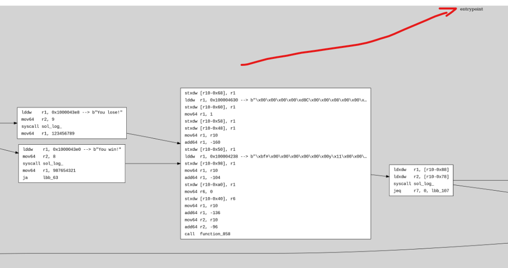
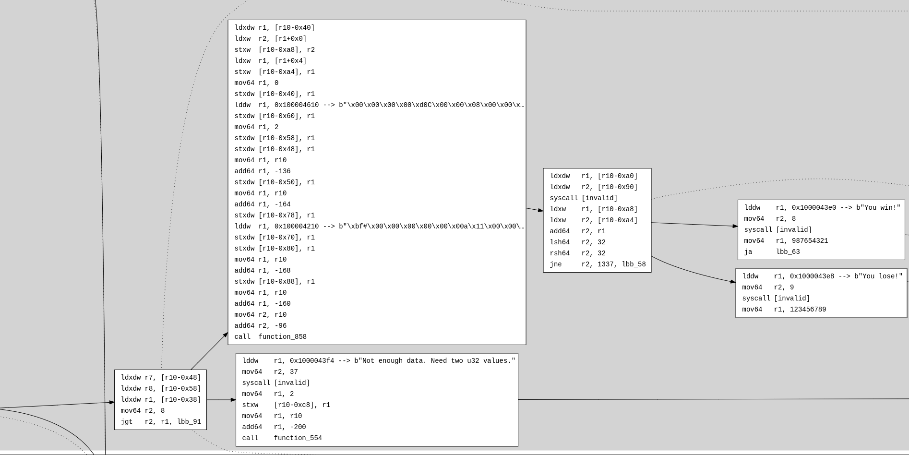

# Control Flow Graph (CFG)

Sol-azy can extract a static control flow graph (CFG) from a compiled Solana eBPF program.  
The output is a Graphviz-compatible `.dot` file representing function-level control flow between basic blocks.

This is useful for:

- Visualizing branching behavior
- Locating unreachable code
- Detecting loop structures
- Understanding high-level logic without source code

---

## Overview

The CFG is generated via:

```rust
pub fn export_cfg_to_dot(
    program: &[u8],
    analysis: &mut Analysis,
    path: impl AsRef<Path>,
    reduced: bool,
    only_entrypoint: bool,
) -> std::io::Result<()>
```

Sol-azy uses the static `Analysis` engine to:

1. Identify all **functions**
2. Segment them into **basic blocks**
3. Record all **dominators** and **edges**
4. Render each function as a `subgraph cluster` in Graphviz `.dot` syntax

### Filtering the graph

* `--reduced`: excludes library functions that appear before the program’s entrypoint, reducing noise.
* `--only-entrypoint`: includes **only** the function where execution starts, allowing for very focused manual exploration (e.g., with [`dotting`](dotting.md)).

---

## Structure of the Graph

Each **basic block** is rendered as a node with label:

```
lbb_<id> [label=<<table>...</table>>];
```

- The instruction list is printed line-by-line
- If a string is found via `LD_DW_IMM` + `MOV64_IMM`, it’s appended with: `--> b"..."`
- Long strings are truncated

### Resolving Edges

Edges are derived from instruction flow and jump destinations:

- **Conditional jumps** produce two outgoing edges
- **Unconditional jumps** produce one
- **Return or syscall** ends a block
- **Dominator relationships** (parent-child) are shown with dotted arrows (`style=dotted; arrowhead=none`)

**Detailed behavior:** \
Sol-azy draws edges based on:

- `jne`, `jeq`, etc. → conditional edges
- `ja` (jump always) → unconditional
- `call`, `exit`, and `ret` → no outgoing edge
- `dominator_parent` → rendered with:
  ```dot
  lbb_A -> lbb_B [style=dotted; arrowhead=none];
  ```

---

## Example (DOT snippet)

Here’s a raw `.dot` snippet generated by Sol-azy:

```dot
lbb_58 [label=<<table border="0" cellborder="0" cellpadding="3">
  <tr><td align="left">lddw</td><td align="left">r1, 0x1000043e8 --&gt; b"You lose!"</td></tr>
  <tr><td align="left">mov64</td><td align="left">r2, 9</td></tr>
  <tr><td align="left">syscall</td><td align="left">[invalid]</td></tr>
  <tr><td align="left">mov64</td><td align="left">r1, 123456789</td></tr>
</table>>];
```

Graphviz will render this as a block node with a 4-row table inside.

---

## How Sol-azy Generates It

CFG generation is implemented in:

```rust
pub fn export_cfg_to_dot(
    program: &[u8],
    analysis: &mut Analysis,
    path: impl AsRef<Path>,
)
```

It walks:

1. The `analysis.functions` map
2. Each function’s set of `cfg_nodes`
3. Each node’s instructions (via `analysis.instructions`)
4. Control destinations (e.g., `jne`, `ja`, `call`)
5. Dominator relationships (`cfg_node.dominator_parent`)

The layout is rendered using Graphviz-style clusters:

```dot
subgraph cluster_42 {
    label="function_name";
    lbb_42 [ ... ];
}
```

---

## Strings from `.rodata`

CFG generation is enhanced by the same string resolution logic used in disassembly:

```rust
fn get_string_repr(
    program: &[u8],
    insn: &Insn,
    next_insn: Option<&Insn>
) -> String
```

This makes string loads from `.rodata` visible directly in the graph, so when an instruction like::

```asm
lddw r1, 0x1000043e8
```

is followed by:

```asm
mov64 r2, 9
```

Sol-azy uses this to resolve:

```text
b"You lose!"
```

It is rendered like this:

```html
<td align="left">r1, 0x1000043e8 --&gt; b"You lose!"</td>
```

This makes constant decoding directly visible in the graph.

---

## Rendering the Graph

Once `cfg.dot` is generated, use:

```bash
dot -Tsvg cfg.dot -o cfg.svg
xdot cfg.dot         # for interactive navigation
```

> ⚠️ For very large programs, even the `--reduced` version of the CFG can take significant time to generate due to the size and complexity of the bytecode being analyzed and rendered by `dot`.

---

## Function Grouping

Each function is placed into a `subgraph cluster` for clarity. This helps:

- Separate function-level CFGs
- Navigate large programs
- Find easily the main part

Entrypoint Example:

```dot
subgraph cluster_3 {
    label="entrypoint";
    tooltip=lbb_3;
    lbb_3 [label=<<table border="0" cellborder="0" cellpadding="3"><tr><td align="left">mov64</td><td align="left">r2, r1</td></tr><tr><td align="left">mov64</td><td align="left">r1, r10</td></tr><tr><td align="left">add64</td><td align="left">r1, -96</td></tr><tr><td align="left">call</td><td align="left">function_308</td></tr></table>>];
    lbb_7 [label=<<table border="0" cellborder="0" cellpadding="3"><tr><td align="left">ldxdw</td><td align="left">r7, [r10-0x48]</td></tr><tr><td align="left">ldxdw</td><td align="left">r8, [r10-0x58]</td></tr><tr><td align="left">ldxdw</td><td align="left">r1, [r10-0x38]</td></tr><tr><td align="left">mov64</td><td align="left">r2, 8</td></tr><tr><td align="left">jgt</td><td align="left">r2, r1, lbb_91</td></tr></table>>];
    lbb_91 [label=<<table border="0" cellborder="0" cellpadding="3"><tr><td align="left">lddw</td><td align="left">r1, 0x1000043f4 --&gt; b&quot;Not enough data. Need two u32 values.&quot;</td></tr><tr><td align="left">mov64</td><td align="left">r2, 37</td></tr><tr><td align="left">syscall</td><td align="left">[invalid]</td></tr><tr><td align="left">mov64</td><td align="left">r1, 2</td></tr><tr><td align="left">stxw</td><td align="left">[r10-0xc8], r1</td></tr><tr><td align="left">mov64</td><td align="left">r1, r10</td></tr><tr><td align="left">add64</td><td align="left">r1, -200</td></tr><tr><td align="left">call</td><td align="left">function_554</td></tr></table>>];
    lbb_100 [label=<<table border="0" cellborder="0" cellpadding="3"><tr><td align="left">mov64</td><td align="left">r6, r0</td></tr><tr><td align="left">jeq</td><td align="left">r7, 0, lbb_107</td></tr></table>>];
    lbb_12 [label=<<table border="0" cellborder="0" cellpadding="3"><tr><td align="left">ldxdw</td><td align="left">r1, [r10-0x40]</td></tr><tr><td align="left">ldxw</td><td align="left">r2, [r1+0x0]</td></tr><tr><td align="left">stxw</td><td align="left">[r10-0xa8], r2</td></tr><tr><td align="left">ldxw</td><td align="left">r1, [r1+0x4]</td></tr><tr><td align="left">stxw</td><td align="left">[r10-0xa4], r1</td></tr><tr><td align="left">mov64</td><td align="left">r1, 0</td></tr><tr><td align="left">stxdw</td><td align="left">[r10-0x40], r1</td></tr><tr><td align="left">lddw</td><td align="left">r1, 0x100004610 --&gt; b&quot;\x00\x00\x00\x00\xd0C\x00\x00\x08\x00\x00\x…</td></tr><tr><td align="left">stxdw</td><td align="left">[r10-0x60], r1</td></tr><tr><td align="left">mov64</td><td align="left">r1, 2</td></tr><tr><td align="left">stxdw</td><td align="left">[r10-0x58], r1</td></tr><tr><td align="left">stxdw</td><td align="left">[r10-0x48], r1</td></tr><tr><td align="left">mov64</td><td align="left">r1, r10</td></tr><tr><td align="left">add64</td><td align="left">r1, -136</td></tr><tr><td align="left">stxdw</td><td align="left">[r10-0x50], r1</td></tr><tr><td align="left">mov64</td><td align="left">r1, r10</td></tr><tr><td align="left">add64</td><td align="left">r1, -164</td></tr><tr><td align="left">stxdw</td><td align="left">[r10-0x78], r1</td></tr><tr><td align="left">lddw</td><td align="left">r1, 0x100004210 --&gt; b&quot;\xbf#\x00\x00\x00\x00\x00\x00a\x11\x00\x00\…</td></tr><tr><td align="left">stxdw</td><td align="left">[r10-0x70], r1</td></tr><tr><td align="left">stxdw</td><td align="left">[r10-0x80], r1</td></tr><tr><td align="left">mov64</td><td align="left">r1, r10</td></tr><tr><td align="left">add64</td><td align="left">r1, -168</td></tr><tr><td align="left">stxdw</td><td align="left">[r10-0x88], r1</td></tr><tr><td align="left">mov64</td><td align="left">r1, r10</td></tr><tr><td align="left">add64</td><td align="left">r1, -160</td></tr><tr><td align="left">mov64</td><td align="left">r2, r10</td></tr><tr><td align="left">add64</td><td align="left">r2, -96</td></tr><tr><td align="left">call</td><td align="left">function_858</td></tr></table>>];
    lbb_43 [label=<<table border="0" cellborder="0" cellpadding="3"><tr><td align="left">ldxdw</td><td align="left">r1, [r10-0xa0]</td></tr><tr><td align="left">ldxdw</td><td align="left">r2, [r10-0x90]</td></tr><tr><td align="left">syscall</td><td align="left">[invalid]</td></tr><tr><td align="left">ldxw</td><td align="left">r1, [r10-0xa8]</td></tr><tr><td align="left">ldxw</td><td align="left">r2, [r10-0xa4]</td></tr><tr><td align="left">add64</td><td align="left">r2, r1</td></tr><tr><td align="left">lsh64</td><td align="left">r2, 32</td></tr><tr><td align="left">rsh64</td><td align="left">r2, 32</td></tr><tr><td align="left">jne</td><td align="left">r2, 1337, lbb_58</td></tr></table>>];
    lbb_58 [label=<<table border="0" cellborder="0" cellpadding="3"><tr><td align="left">lddw</td><td align="left">r1, 0x1000043e8 --&gt; b&quot;You lose!&quot;</td></tr><tr><td align="left">mov64</td><td align="left">r2, 9</td></tr><tr><td align="left">syscall</td><td align="left">[invalid]</td></tr><tr><td align="left">mov64</td><td align="left">r1, 123456789</td></tr></table>>];
    lbb_52 [label=<<table border="0" cellborder="0" cellpadding="3"><tr><td align="left">lddw</td><td align="left">r1, 0x1000043e0 --&gt; b&quot;You win!&quot;</td></tr><tr><td align="left">mov64</td><td align="left">r2, 8</td></tr><tr><td align="left">syscall</td><td align="left">[invalid]</td></tr><tr><td align="left">mov64</td><td align="left">r1, 987654321</td></tr><tr><td align="left">ja</td><td align="left">lbb_63</td></tr></table>>];
    lbb_63 [label=<<table border="0" cellborder="0" cellpadding="3"><tr><td align="left">stxdw</td><td align="left">[r10-0x68], r1</td></tr><tr><td align="left">lddw</td><td align="left">r1, 0x100004630 --&gt; b&quot;\x00\x00\x00\x00\xd8C\x00\x00\x08\x00\x00\x…</td></tr><tr><td align="left">stxdw</td><td align="left">[r10-0x60], r1</td></tr><tr><td align="left">mov64</td><td align="left">r1, 1</td></tr><tr><td align="left">stxdw</td><td align="left">[r10-0x58], r1</td></tr><tr><td align="left">stxdw</td><td align="left">[r10-0x48], r1</td></tr><tr><td align="left">mov64</td><td align="left">r1, r10</td></tr><tr><td align="left">add64</td><td align="left">r1, -160</td></tr><tr><td align="left">stxdw</td><td align="left">[r10-0x50], r1</td></tr><tr><td align="left">lddw</td><td align="left">r1, 0x100004238 --&gt; b&quot;\xbf#\x00\x00\x00\x00\x00\x00y\x11\x00\x00\…</td></tr><tr><td align="left">stxdw</td><td align="left">[r10-0x98], r1</td></tr><tr><td align="left">mov64</td><td align="left">r1, r10</td></tr><tr><td align="left">add64</td><td align="left">r1, -104</td></tr><tr><td align="left">stxdw</td><td align="left">[r10-0xa0], r1</td></tr><tr><td align="left">mov64</td><td align="left">r6, 0</td></tr><tr><td align="left">stxdw</td><td align="left">[r10-0x40], r6</td></tr><tr><td align="left">mov64</td><td align="left">r1, r10</td></tr><tr><td align="left">add64</td><td align="left">r1, -136</td></tr><tr><td align="left">mov64</td><td align="left">r2, r10</td></tr><tr><td align="left">add64</td><td align="left">r2, -96</td></tr><tr><td align="left">call</td><td align="left">function_858</td></tr></table>>];
    lbb_86 [label=<<table border="0" cellborder="0" cellpadding="3"><tr><td align="left">ldxdw</td><td align="left">r1, [r10-0x88]</td></tr><tr><td align="left">ldxdw</td><td align="left">r2, [r10-0x78]</td></tr><tr><td align="left">syscall</td><td align="left">[invalid]</td></tr><tr><td align="left">jeq</td><td align="left">r7, 0, lbb_107</td></tr></table>>];
    lbb_90 [label=<<table border="0" cellborder="0" cellpadding="3"><tr><td align="left">ja</td><td align="left">lbb_102</td></tr></table>>];
    lbb_102 [label=<<table border="0" cellborder="0" cellpadding="3"><tr><td align="left">add64</td><td align="left">r8, 16</td></tr><tr><td align="left">ja</td><td align="left">lbb_109</td></tr></table>>];
    lbb_109 [label=<<table border="0" cellborder="0" cellpadding="3"><tr><td align="left">ldxdw</td><td align="left">r1, [r8+0x0]</td></tr><tr><td align="left">ldxdw</td><td align="left">r2, [r8-0x8]</td></tr><tr><td align="left">ldxdw</td><td align="left">r3, [r2+0x0]</td></tr><tr><td align="left">add64</td><td align="left">r3, -1</td></tr><tr><td align="left">stxdw</td><td align="left">[r2+0x0], r3</td></tr><tr><td align="left">jne</td><td align="left">r3, 0, lbb_118</td></tr></table>>];
    lbb_115 [label=<<table border="0" cellborder="0" cellpadding="3"><tr><td align="left">ldxdw</td><td align="left">r3, [r2+0x8]</td></tr><tr><td align="left">add64</td><td align="left">r3, -1</td></tr><tr><td align="left">stxdw</td><td align="left">[r2+0x8], r3</td></tr></table>>];
    lbb_118 [label=<<table border="0" cellborder="0" cellpadding="3"><tr><td align="left">ldxdw</td><td align="left">r2, [r1+0x0]</td></tr><tr><td align="left">add64</td><td align="left">r2, -1</td></tr><tr><td align="left">stxdw</td><td align="left">[r1+0x0], r2</td></tr><tr><td align="left">jne</td><td align="left">r2, 0, lbb_104</td></tr></table>>];
    lbb_122 [label=<<table border="0" cellborder="0" cellpadding="3"><tr><td align="left">ldxdw</td><td align="left">r2, [r1+0x8]</td></tr><tr><td align="left">add64</td><td align="left">r2, -1</td></tr><tr><td align="left">stxdw</td><td align="left">[r1+0x8], r2</td></tr><tr><td align="left">ja</td><td align="left">lbb_104</td></tr></table>>];
    lbb_104 [label=<<table border="0" cellborder="0" cellpadding="3"><tr><td align="left">add64</td><td align="left">r8, 48</td></tr><tr><td align="left">add64</td><td align="left">r7, -1</td></tr><tr><td align="left">jne</td><td align="left">r7, 0, lbb_109</td></tr></table>>];
    lbb_107 [label=<<table border="0" cellborder="0" cellpadding="3"><tr><td align="left">mov64</td><td align="left">r0, r6</td></tr><tr><td align="left">exit</td></tr></table>>];
  }
```



---

## Full Example (Visual)

Here’s what a real Sol-azy-generated CFG can look like:

- Each rectangle = basic block
- Arrows = jumps, calls, or branches
- Dashed arrows = dominator links

Code example:

```rust
use solana_program::{
    account_info::AccountInfo,
    entrypoint,
    entrypoint::ProgramResult,
    pubkey::Pubkey,
    msg,
};

entrypoint!(process_instruction);

fn win() -> u64 {
    msg!("You win!");
    987654321
}

fn loose() -> u64 {
    msg!("You lose!");
    123456789
}

pub fn process_instruction(
    _program_id: &Pubkey,
    _accounts: &[AccountInfo],
    instruction_data: &[u8],
) -> ProgramResult {
    if instruction_data.len() < 8 {
        msg!("Not enough data. Need two u32 values.");
        return Err(solana_program::program_error::ProgramError::InvalidInstructionData);
    }

    let a = u32::from_le_bytes(instruction_data[0..4].try_into().unwrap());
    let b = u32::from_le_bytes(instruction_data[4..8].try_into().unwrap());

    msg!("Inputs: {} + {}", a, b);

    let result = if a + b == 1337 {
        win()
    } else {
        loose()
    };

    msg!("Result: {}", result);

    Ok(())
}
```

CFG recovered from bytecode:




---

## Related

- [Reduced CFG](reduced_cfg.md)
- [Editing CFG (Dotting command)](dotting.md)
- [Reverse CLI Command](../cli/reverse.md)