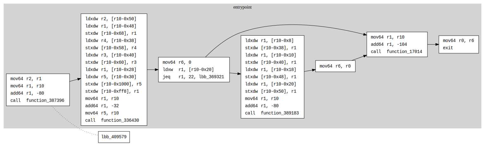
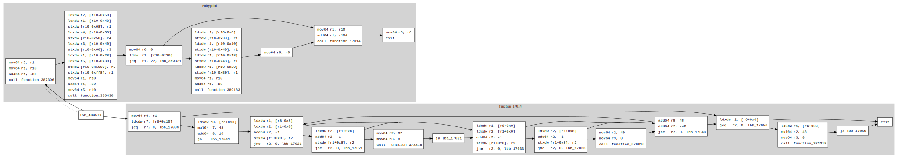

# Dotting: Customizing Reduced CFGs

The `dotting` feature in sol-azy allows you to **manually augment** a reduced control flow graph (CFG) by reinserting specific function clusters from the full graph.

This is particularly useful when using `--reduced` or `--only-entrypoint` modes, which intentionally drop unused or library-heavy functions. With dotting, you can selectively restore those clusters for **targeted analysis**.

---

## Motivation

Reduced graphs simplify reverse engineering, but sometimes:

* Important logic is optimized into shared helpers
* Runtime wrappers (e.g. error handling) live outside the entrypoint
* Functions of interest are excluded unintentionally

With dotting, you don’t need to regenerate a new full CFG.
Instead, you can **grow your existing graph** by manually appending clusters and their edges.

---

## How It Works

1. You create a small JSON file listing function cluster IDs to reinsert.
2. You run the `dotting` command pointing to:

   * The original full `.dot` file (reference),
   * Your reduced `.dot` file,
   * And the JSON config.
3. sol-azy:

   * Adds matching `subgraph cluster_XX` blocks.
   * Appends new edges **only if both sides already exist** in the reduced graph.
4. The result is saved as `updated_<reduced>.dot`.

---

## CLI Usage

```bash
cargo run -- dotting \
  --config path/to/functions.json \
  --reduced-dot path/to/reduced.dot \
  --full-dot path/to/full.dot
```

---

## Config Format

Your JSON file should look like:

```json
{
  "functions": ["10", "42", "87"]
}
```

Each entry is a cluster ID (i.e., the number in `cluster_<id>` from the `.dot` file).
These are generally assigned incrementally during graph generation.

You can locate these IDs by inspecting the full `.dot` or searching for strings like:

```dot
subgraph cluster_42 {
    label="function_name";
    ...
}
```

---

## Example Workflow

0. **[one-time action]** Generate a full graph _(It allows for easily selecting specific clusters without re-analyzing the full bytecode every time a function needs to be added)_:

   ```bash
   cargo run -- reverse \
     --mode cfg \
     --bytecodes-file program.so \
     --out-dir ./full \
   ```

1. Generate a reduced graph with only the entrypoint:

   ```bash
   cargo run -- reverse \
     --mode cfg \
     --bytecodes-file program.so \
     --out-dir ./out \
     --only-entrypoint
   ```

2. Create a `functions.json` file:

   ```json
   {
    "functions": ["17014"]
   }
   ```

3. Run dotting:

   ```bash
   cargo run -- dotting \
     --config ./functions.json \
     --reduced-dot ./out/cfg.dot \
     --full-dot ./full/cfg.dot
   ```

4. Visualize the result:

   ```bash
   xdot ./out/updated_cfg.dot
   ```

## Example showcase

### Before

```dot
digraph {
graph [
rankdir=LR;
concentrate=True;
style=filled;
color=lightgrey;
];
node [
shape=rect;
style=filled;
fillcolor=white;
fontname="Courier New";
];
edge [
fontname="Courier New";
];
  subgraph cluster_369287 {
    label="entrypoint";
    tooltip=lbb_369287;
    lbb_369287 [label=<<table border="0" cellborder="0" cellpadding="3"><tr><td align="left">mov64</td><td align="left">r2, r1</td></tr><tr><td align="left">mov64</td><td align="left">r1, r10</td></tr><tr><td align="left">add64</td><td align="left">r1, -80</td></tr><tr><td align="left">call</td><td align="left">function_387396</td></tr></table>>];
    lbb_369291 [label=<<table border="0" cellborder="0" cellpadding="3"><tr><td align="left">ldxdw</td><td align="left">r2, [r10-0x50]</td></tr><tr><td align="left">ldxdw</td><td align="left">r1, [r10-0x48]</td></tr><tr><td align="left">stxdw</td><td align="left">[r10-0x68], r1</td></tr><tr><td align="left">ldxdw</td><td align="left">r4, [r10-0x38]</td></tr><tr><td align="left">stxdw</td><td align="left">[r10-0x58], r4</td></tr><tr><td align="left">ldxdw</td><td align="left">r3, [r10-0x40]</td></tr><tr><td align="left">stxdw</td><td align="left">[r10-0x60], r3</td></tr><tr><td align="left">ldxdw</td><td align="left">r1, [r10-0x28]</td></tr><tr><td align="left">ldxdw</td><td align="left">r5, [r10-0x30]</td></tr><tr><td align="left">stxdw</td><td align="left">[r10-0x1000], r5</td></tr><tr><td align="left">stxdw</td><td align="left">[r10-0xff8], r1</td></tr><tr><td align="left">mov64</td><td align="left">r1, r10</td></tr><tr><td align="left">add64</td><td align="left">r1, -32</td></tr><tr><td align="left">mov64</td><td align="left">r5, r10</td></tr><tr><td align="left">call</td><td align="left">function_336430</td></tr></table>>];
    lbb_369306 [label=<<table border="0" cellborder="0" cellpadding="3"><tr><td align="left">mov64</td><td align="left">r6, 0</td></tr><tr><td align="left">ldxw</td><td align="left">r1, [r10-0x20]</td></tr><tr><td align="left">jeq</td><td align="left">r1, 22, lbb_369321</td></tr></table>>];
    lbb_369309 [label=<<table border="0" cellborder="0" cellpadding="3"><tr><td align="left">ldxdw</td><td align="left">r1, [r10-0x8]</td></tr><tr><td align="left">stxdw</td><td align="left">[r10-0x38], r1</td></tr><tr><td align="left">ldxdw</td><td align="left">r1, [r10-0x10]</td></tr><tr><td align="left">stxdw</td><td align="left">[r10-0x40], r1</td></tr><tr><td align="left">ldxdw</td><td align="left">r1, [r10-0x18]</td></tr><tr><td align="left">stxdw</td><td align="left">[r10-0x48], r1</td></tr><tr><td align="left">ldxdw</td><td align="left">r1, [r10-0x20]</td></tr><tr><td align="left">stxdw</td><td align="left">[r10-0x50], r1</td></tr><tr><td align="left">mov64</td><td align="left">r1, r10</td></tr><tr><td align="left">add64</td><td align="left">r1, -80</td></tr><tr><td align="left">call</td><td align="left">function_389183</td></tr></table>>];
    lbb_369320 [label=<<table border="0" cellborder="0" cellpadding="3"><tr><td align="left">mov64</td><td align="left">r6, r0</td></tr></table>>];
    lbb_369321 [label=<<table border="0" cellborder="0" cellpadding="3"><tr><td align="left">mov64</td><td align="left">r1, r10</td></tr><tr><td align="left">add64</td><td align="left">r1, -104</td></tr><tr><td align="left">call</td><td align="left">function_17014</td></tr></table>>];
    lbb_369324 [label=<<table border="0" cellborder="0" cellpadding="3"><tr><td align="left">mov64</td><td align="left">r0, r6</td></tr><tr><td align="left">exit</td></tr></table>>];
  }
  lbb_369287 -> lbb_409579 [style=dotted; arrowhead=none];
  lbb_369287 -> {lbb_369291};
  lbb_369291 -> lbb_369287 [style=dotted; arrowhead=none];
  lbb_369291 -> {lbb_369306};
  lbb_369306 -> lbb_369291 [style=dotted; arrowhead=none];
  lbb_369306 -> {lbb_369309 lbb_369321};
  lbb_369309 -> lbb_369306 [style=dotted; arrowhead=none];
  lbb_369309 -> {lbb_369320};
  lbb_369320 -> lbb_369309 [style=dotted; arrowhead=none];
  lbb_369320 -> {lbb_369321};
  lbb_369321 -> lbb_369306 [style=dotted; arrowhead=none];
  lbb_369321 -> {lbb_369324};
  lbb_369324 -> lbb_369321 [style=dotted; arrowhead=none];
}
```






### After

```dot
digraph {
graph [
rankdir=LR;
concentrate=True;
style=filled;
color=lightgrey;
];
node [
shape=rect;
style=filled;
fillcolor=white;
fontname="Courier New";
];
edge [
fontname="Courier New";
];
  subgraph cluster_369287 {
    label="entrypoint";
    tooltip=lbb_369287;
    lbb_369287 [label=<<table border="0" cellborder="0" cellpadding="3"><tr><td align="left">mov64</td><td align="left">r2, r1</td></tr><tr><td align="left">mov64</td><td align="left">r1, r10</td></tr><tr><td align="left">add64</td><td align="left">r1, -80</td></tr><tr><td align="left">call</td><td align="left">function_387396</td></tr></table>>];
    lbb_369291 [label=<<table border="0" cellborder="0" cellpadding="3"><tr><td align="left">ldxdw</td><td align="left">r2, [r10-0x50]</td></tr><tr><td align="left">ldxdw</td><td align="left">r1, [r10-0x48]</td></tr><tr><td align="left">stxdw</td><td align="left">[r10-0x68], r1</td></tr><tr><td align="left">ldxdw</td><td align="left">r4, [r10-0x38]</td></tr><tr><td align="left">stxdw</td><td align="left">[r10-0x58], r4</td></tr><tr><td align="left">ldxdw</td><td align="left">r3, [r10-0x40]</td></tr><tr><td align="left">stxdw</td><td align="left">[r10-0x60], r3</td></tr><tr><td align="left">ldxdw</td><td align="left">r1, [r10-0x28]</td></tr><tr><td align="left">ldxdw</td><td align="left">r5, [r10-0x30]</td></tr><tr><td align="left">stxdw</td><td align="left">[r10-0x1000], r5</td></tr><tr><td align="left">stxdw</td><td align="left">[r10-0xff8], r1</td></tr><tr><td align="left">mov64</td><td align="left">r1, r10</td></tr><tr><td align="left">add64</td><td align="left">r1, -32</td></tr><tr><td align="left">mov64</td><td align="left">r5, r10</td></tr><tr><td align="left">call</td><td align="left">function_336430</td></tr></table>>];
    lbb_369306 [label=<<table border="0" cellborder="0" cellpadding="3"><tr><td align="left">mov64</td><td align="left">r6, 0</td></tr><tr><td align="left">ldxw</td><td align="left">r1, [r10-0x20]</td></tr><tr><td align="left">jeq</td><td align="left">r1, 22, lbb_369321</td></tr></table>>];
    lbb_369309 [label=<<table border="0" cellborder="0" cellpadding="3"><tr><td align="left">ldxdw</td><td align="left">r1, [r10-0x8]</td></tr><tr><td align="left">stxdw</td><td align="left">[r10-0x38], r1</td></tr><tr><td align="left">ldxdw</td><td align="left">r1, [r10-0x10]</td></tr><tr><td align="left">stxdw</td><td align="left">[r10-0x40], r1</td></tr><tr><td align="left">ldxdw</td><td align="left">r1, [r10-0x18]</td></tr><tr><td align="left">stxdw</td><td align="left">[r10-0x48], r1</td></tr><tr><td align="left">ldxdw</td><td align="left">r1, [r10-0x20]</td></tr><tr><td align="left">stxdw</td><td align="left">[r10-0x50], r1</td></tr><tr><td align="left">mov64</td><td align="left">r1, r10</td></tr><tr><td align="left">add64</td><td align="left">r1, -80</td></tr><tr><td align="left">call</td><td align="left">function_389183</td></tr></table>>];
    lbb_369320 [label=<<table border="0" cellborder="0" cellpadding="3"><tr><td align="left">mov64</td><td align="left">r6, r0</td></tr></table>>];
    lbb_369321 [label=<<table border="0" cellborder="0" cellpadding="3"><tr><td align="left">mov64</td><td align="left">r1, r10</td></tr><tr><td align="left">add64</td><td align="left">r1, -104</td></tr><tr><td align="left">call</td><td align="left">function_17014</td></tr></table>>];
    lbb_369324 [label=<<table border="0" cellborder="0" cellpadding="3"><tr><td align="left">mov64</td><td align="left">r0, r6</td></tr><tr><td align="left">exit</td></tr></table>>];
  }
  lbb_369287 -> lbb_409579 [style=dotted; arrowhead=none];
  lbb_369287 -> {lbb_369291};
  lbb_369291 -> lbb_369287 [style=dotted; arrowhead=none];
  lbb_369291 -> {lbb_369306};
  lbb_369306 -> lbb_369291 [style=dotted; arrowhead=none];
  lbb_369306 -> {lbb_369309 lbb_369321};
  lbb_369309 -> lbb_369306 [style=dotted; arrowhead=none];
  lbb_369309 -> {lbb_369320};
  lbb_369320 -> lbb_369309 [style=dotted; arrowhead=none];
  lbb_369320 -> {lbb_369321};
  lbb_369321 -> lbb_369306 [style=dotted; arrowhead=none];
  lbb_369321 -> {lbb_369324};
  lbb_369324 -> lbb_369321 [style=dotted; arrowhead=none];

subgraph cluster_17014 {
    label="function_17014";
    tooltip=lbb_17014;
    lbb_17014 [label=<<table border="0" cellborder="0" cellpadding="3"><tr><td align="left">mov64</td><td align="left">r6, r1</td></tr><tr><td align="left">ldxdw</td><td align="left">r7, [r6+0x10]</td></tr><tr><td align="left">jeq</td><td align="left">r7, 0, lbb_17036</td></tr></table>>];
    lbb_17017 [label=<<table border="0" cellborder="0" cellpadding="3"><tr><td align="left">ldxdw</td><td align="left">r8, [r6+0x8]</td></tr><tr><td align="left">mul64</td><td align="left">r7, 48</td></tr><tr><td align="left">add64</td><td align="left">r8, 16</td></tr><tr><td align="left">ja</td><td align="left">lbb_17043</td></tr></table>>];
    lbb_17043 [label=<<table border="0" cellborder="0" cellpadding="3"><tr><td align="left">ldxdw</td><td align="left">r1, [r8-0x8]</td></tr><tr><td align="left">ldxdw</td><td align="left">r2, [r1+0x0]</td></tr><tr><td align="left">add64</td><td align="left">r2, -1</td></tr><tr><td align="left">stxdw</td><td align="left">[r1+0x0], r2</td></tr><tr><td align="left">jne</td><td align="left">r2, 0, lbb_17021</td></tr></table>>];
    lbb_17048 [label=<<table border="0" cellborder="0" cellpadding="3"><tr><td align="left">ldxdw</td><td align="left">r2, [r1+0x8]</td></tr><tr><td align="left">add64</td><td align="left">r2, -1</td></tr><tr><td align="left">stxdw</td><td align="left">[r1+0x8], r2</td></tr><tr><td align="left">jne</td><td align="left">r2, 0, lbb_17021</td></tr></table>>];
    lbb_17052 [label=<<table border="0" cellborder="0" cellpadding="3"><tr><td align="left">mov64</td><td align="left">r2, 32</td></tr><tr><td align="left">mov64</td><td align="left">r3, 8</td></tr><tr><td align="left">call</td><td align="left">function_373318</td></tr></table>>];
    lbb_17055 [label=<<table border="0" cellborder="0" cellpadding="3"><tr><td align="left">ja</td><td align="left">lbb_17021</td></tr></table>>];
    lbb_17021 [label=<<table border="0" cellborder="0" cellpadding="3"><tr><td align="left">ldxdw</td><td align="left">r1, [r8+0x0]</td></tr><tr><td align="left">ldxdw</td><td align="left">r2, [r1+0x0]</td></tr><tr><td align="left">add64</td><td align="left">r2, -1</td></tr><tr><td align="left">stxdw</td><td align="left">[r1+0x0], r2</td></tr><tr><td align="left">jne</td><td align="left">r2, 0, lbb_17033</td></tr></table>>];
    lbb_17026 [label=<<table border="0" cellborder="0" cellpadding="3"><tr><td align="left">ldxdw</td><td align="left">r2, [r1+0x8]</td></tr><tr><td align="left">add64</td><td align="left">r2, -1</td></tr><tr><td align="left">stxdw</td><td align="left">[r1+0x8], r2</td></tr><tr><td align="left">jne</td><td align="left">r2, 0, lbb_17033</td></tr></table>>];
    lbb_17030 [label=<<table border="0" cellborder="0" cellpadding="3"><tr><td align="left">mov64</td><td align="left">r2, 40</td></tr><tr><td align="left">mov64</td><td align="left">r3, 8</td></tr><tr><td align="left">call</td><td align="left">function_373318</td></tr></table>>];
    lbb_17033 [label=<<table border="0" cellborder="0" cellpadding="3"><tr><td align="left">add64</td><td align="left">r8, 48</td></tr><tr><td align="left">add64</td><td align="left">r7, -48</td></tr><tr><td align="left">jne</td><td align="left">r7, 0, lbb_17043</td></tr></table>>];
    lbb_17036 [label=<<table border="0" cellborder="0" cellpadding="3"><tr><td align="left">ldxdw</td><td align="left">r2, [r6+0x0]</td></tr><tr><td align="left">jeq</td><td align="left">r2, 0, lbb_17056</td></tr></table>>];
    lbb_17038 [label=<<table border="0" cellborder="0" cellpadding="3"><tr><td align="left">ldxdw</td><td align="left">r1, [r6+0x8]</td></tr><tr><td align="left">mul64</td><td align="left">r2, 48</td></tr><tr><td align="left">mov64</td><td align="left">r3, 8</td></tr><tr><td align="left">call</td><td align="left">function_373318</td></tr></table>>];
    lbb_17042 [label=<<table border="0" cellborder="0" cellpadding="3"><tr><td align="left">ja</td><td align="left">lbb_17056</td></tr></table>>];
    lbb_17056 [label=<<table border="0" cellborder="0" cellpadding="3"><tr><td align="left">exit</td></tr></table>>];
  }

lbb_17014 -> {lbb_17017 lbb_17036};
lbb_17017 -> {lbb_17043};
lbb_17021 -> {lbb_17026 lbb_17033};
lbb_17026 -> {lbb_17030 lbb_17033};
lbb_17030 -> {lbb_17033};
lbb_17033 -> {lbb_17036 lbb_17043};
lbb_17036 -> {lbb_17038 lbb_17056};
lbb_17038 -> {lbb_17042};
lbb_17042 -> {lbb_17056};
lbb_17043 -> {lbb_17021 lbb_17048};
lbb_17048 -> {lbb_17021 lbb_17052};
lbb_17052 -> {lbb_17055};
lbb_17055 -> {lbb_17021};
lbb_409579 -> {lbb_17014 lbb_369287};
}
```





---

## Behavior Notes

* Edges are only added if **both** source and target basic blocks are already present.
* If you want edges for new blocks too, consider adding additional clusters.
* `updated_cfg.dot` is created next to your original file.
* The original `cfg.dot` is **not** modified.

---

## Tips

* Combine `--only-entrypoint` + `dotting` to **build your CFG incrementally**.

---

## Related

* [Reduced CFGs](reduced_cfg.md)
* [CFG](cfg.md)
