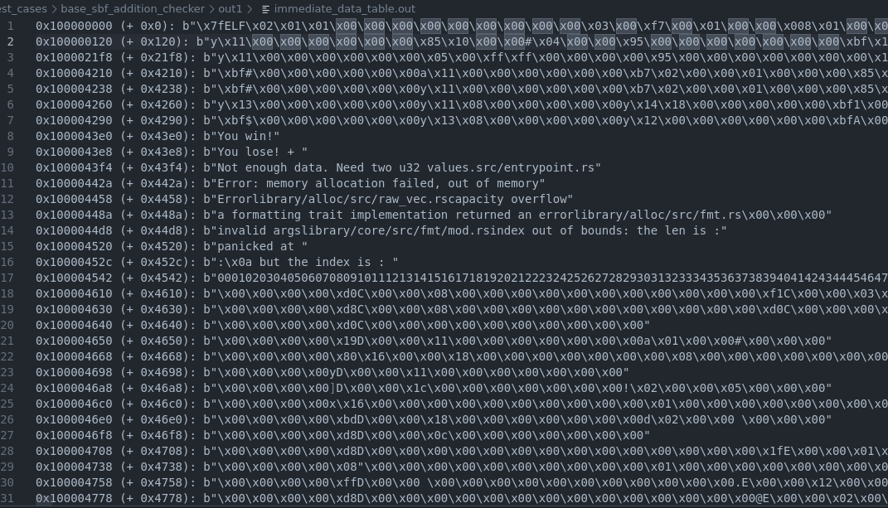

# Immediate Data Tracking

Sol-azy performs tracking of immediate values loaded from `.rodata` via `LD_DW_IMM` instructions.  
This feature is crucial to recover strings, error messages, and embedded constants that are otherwise opaque in the bytecode.

---

## How it works

Solana eBPF programs often use this pattern to load a constant string:

```text
lddw   r1, 0x1000043e8
mov64  r2, 9
```

- The `lddw` instruction loads an offset in `.rodata`
- The `mov64` gives a length (usually in bytes)
- Sol-azy uses these two to extract a slice of memory and decode it

If the memory region looks printable (ASCII-compatible), it is rendered as a string like:

```text
b"You lose!"
```

Otherwise, a hex-escaped byte string is emitted.

---

## Output File: `immediate_data_table.out`

This file lists all detected `.rodata` ranges accessed via `LD_DW_IMM`, whether or not they were also used in disassembly.

### Format

Each line contains:

```text
<absolute_address> (+ <relative_offset>): <decoded_bytes>
```

Example:

```
0x1000043e0 (+ 0x43e0): b"You win!"
0x1000043e8 (+ 0x43e8): b"You lose!"
0x100004434 (+ 0x434): b"Not enough data. Need two u32 values.src/entrypoint.rs"
```

> The `relative_offset` is computed relative to `MM_RODATA_START`, and is used to index into the ELF's `.rodata` section.

---

## Visual Reference

Here's a screenshot of a real `immediate_data_table.out` file generated from a test case:



We can see:

- Success and failure strings: `"You win!"`, `"You lose!"`
- Panic messages
- Rust format strings
- Even full numeric patterns (e.g. `"00010203..."`)

---

## Behind the scenes

The logic is handled by this function:

```rust
fn disassemble_wrapper(
    program: &[u8],
    analysis: &mut Analysis,
    imm_tracker_wrapped: Option<&mut ImmediateTracker>,
    path: P,
)
```

Each `LD_DW_IMM` is analyzed, and its value is registered using:

```rust
imm_tracker.register_offset(insn.imm as usize);
```

Then, for each tracked range:

- The `program` is sliced using offset logic
- The result is passed to:

```rust
pub fn format_bytes(slice: &[u8]) -> String
```

which escapes non-printables and prints ASCII as-is.

### LD_DW_IMM: Key Instructions and Address Keys

The tracking system is triggered **exclusively** by `LD_DW_IMM` instructions, which are used to load 64-bit constants.  
When such an instruction loads an address greater than or equal to `MM_RODATA_START`, Sol-azy considers it a `.rodata` access.

These addresses become the **keys** of the `immediate_data_table.out` output.

Example:

```text
lddw   r1, 0x1000043e0   ; ← This address becomes a key
mov64  r2, 8             ; ← Length hint
```

This results in:

```
0x1000043e0 (+ 0x43e0): b"You win!"
```

### Range Truncation: Avoiding Overlaps

In programs with many `LD_DW_IMM`, multiple memory regions may point into the same `.rodata` segment.  
To avoid overlap between two string regions, Sol-azy performs a **forward truncation**:

- It registers each `LD_DW_IMM` address (`new_start`)
- It finds the **next closest start** already known
- It truncates any overlapping previous entry so that no two extracted ranges overlap

This ensures that the memory region allocated for one string or constant **does not accidentally contain bytes meant for another**.

> ⚠️ **Important Note on Partial Overlaps**

The truncation mechanism ensures that two tracked `.rodata` regions do not overlap, but this **does not imply** that only the non-overlapping portion of earlier data is relevant.

For example:

- A `lddw` at `0x1` loads 4 bytes of useful data.
- Later, a `lddw` at `0x3` uses only the high bits (e.g., last 2 bytes).

Even if these regions partially overlap in memory, the system still treats `0x1` as a distinct valid address for its own usage.

This means:

- The data at `0x1` is still considered to start at `0x1`.
- The data at `0x3` is separately tracked, even if it falls inside a previously registered range.

The truncation is **only used to split visible ranges in the output**, not to reinterpret or cut off the semantics of earlier loads.


### Example

Suppose:

```text
lddw r1, 0x1000043e0      ; key #1
lddw r2, 0x1000043e8      ; key #2, appears later in bytecode
```

Even if the length for key #1 is unclear (or too long), Sol-azy will **truncate its range** to stop at `0x1000043e8`.

This avoids having `"You win!" + "You lose!"` accidentally merged into one blob, since both of them will be used independently by separate `LD_DW_IMM` instructions.

---

## Internal Implementation

The tracking structure is a `BTreeMap<usize, usize>`:

```rust
pub struct ImmediateTracker {
    ranges: BTreeMap<usize, usize>, // start => end
}
```

Each `register_offset(new_start)` will:

- Locate the next start value already in `ranges`
- Set `new_end = next_start`
- Truncate any existing range that would overlap with `new_start`

This is enforced even if the memory contents could technically overlap — correctness is prioritized.

---

## When this matters

This tracking is especially useful when:

- The program includes panic messages
- You want to recover hardcoded strings (e.g. `"owner mismatch"`)
- You're analyzing solana_program syscalls with string-based I/O
- You want to reverse undocumented or obfuscated logic

---

## Tips

- Use `--mode disass` or `--mode both` to enable this feature
- If a string appears truncated, check the corresponding `mov64` for its length
- If no `mov64` follows a `lddw`, the default read length is ~50 bytes for the CFG rendering

---

## Related

- [Disassembly](disassembly.md)
- [Control Flow Graph](cfg.md)
- [Reverse CLI Command](../cli/reverse.md)