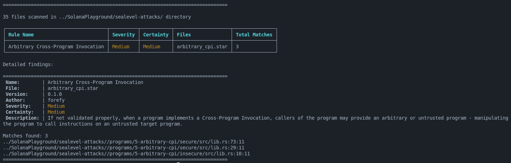

# Example

## 🔍 Use Case: Arbitrary CPI Detection with Templates

Consider the following Rust function:

```rust
pub fn cpi_insecure(ctx: Context<Cpi>, amount: u64) -> ProgramResult {
    solana_program::program::invoke(
        &spl_token::instruction::transfer(
            ctx.accounts.token_program.key,
            ctx.accounts.source.key,
            ctx.accounts.destination.key,
            ctx.accounts.authority.key,
            &[],
            amount,
        )?,
        &[
            ctx.accounts.source.clone(),
            ctx.accounts.destination.clone(),
            ctx.accounts.authority.clone(),
        ],
    )
}
```

This function performs a **Cross-Program Invocation (CPI)** without validating that `ctx.accounts.token_program.key` matches the expected program (i.e., `spl_token::ID`). This is exactly the kind of vulnerability we want to detect using a template like this:

```python
TEMPLATES["CALL_FN_SOLANAPROGRAM_PROGRAM_INVOKE"] = {
    "pattern": {
        "call": {
            "args": "",
            "func": {"idents": ["solana_program", "program", "invoke"]},
        }
    },
    "priority_rule": ["func", "args"],
}
```

## What the Template Does

This template matches any call to `solana_program::program::invoke(...)`, regardless of its arguments.
It uses the `idents` field to match the identifier path in the AST and `priority_rule` to specify the matching order.

## Detection

So the full vulnerable code is:

```rust
use anchor_lang::prelude::*;
use anchor_lang::solana_program;

declare_id!("Fg6PaFpoGXkYsidMpWTK6W2BeZ7FEfcYkg476zPFsLnS");

pub mod arbitrary_cpi_secure2 {
    use super::*;
    pub fn cpi_secure2(ctx: Context<Cpi>, amount: u64) -> ProgramResult {
        if &spl_token::ID != ctx.accounts.token_program.key {
            return Err(ProgramError::IncorrectProgramId);
        }
        solana_program::program::invoke(
            &spl_token::instruction::transfer(
                ctx.accounts.token_program.key,
                ctx.accounts.source.key,
                ctx.accounts.destination.key,
                ctx.accounts.authority.key,
                &[],
                amount,
            )?,
            &[
                ctx.accounts.source.clone(),
                ctx.accounts.destination.clone(),
                ctx.accounts.authority.clone(),
            ],
        )
    }

    pub fn cpi_insecure2(ctx: Context<Cpi>, amount: u64) -> ProgramResult {
        solana_program::program::invoke(
            &spl_token::instruction::transfer(
                ctx.accounts.token_program.key,
                ctx.accounts.source.key,
                ctx.accounts.destination.key,
                ctx.accounts.authority.key,
                &[],
                amount,
            )?,
            &[
                ctx.accounts.source.clone(),
                ctx.accounts.destination.clone(),
                ctx.accounts.authority.clone(),
            ],
        )
    }
}

#[program]
pub mod arbitrary_cpi_secure {
    use super::*;

    pub fn cpi_secure(ctx: Context<Cpi>, amount: u64) -> ProgramResult {
        if &spl_token::ID != ctx.accounts.token_program.key {
            return Err(ProgramError::IncorrectProgramId);
        }
        solana_program::program::invoke(
            &spl_token::instruction::transfer(
                ctx.accounts.token_program.key,
                ctx.accounts.source.key,
                ctx.accounts.destination.key,
                ctx.accounts.authority.key,
                &[],
                amount,
            )?,
            &[
                ctx.accounts.source.clone(),
                ctx.accounts.destination.clone(),
                ctx.accounts.authority.clone(),
            ],
        )
    }

    pub fn cpi_insecure(ctx: Context<Cpi>, amount: u64) -> ProgramResult {
        solana_program::program::invoke(
            &spl_token::instruction::transfer(
                ctx.accounts.token_program.key,
                ctx.accounts.source.key,
                ctx.accounts.destination.key,
                ctx.accounts.authority.key,
                &[],
                amount,
            )?,
            &[
                ctx.accounts.source.clone(),
                ctx.accounts.destination.clone(),
                ctx.accounts.authority.clone(),
            ],
        )
    }
}

#[derive(Accounts)]
pub struct Cpi<'info> {
    source: AccountInfo<'info>,
    destination: AccountInfo<'info>,
    authority: AccountInfo<'info>,
    token_program: AccountInfo<'info>,
}
```

When we run:

```bash
cargo run --release -- \
  sast \
  --target-dir ../SolanaPlayground/sealevel-attacks/ \
  --rules-dir rules/syn_ast
```



sol-azy successfully detects **three instances** of the vulnerability, reported as:

```text
../SolanaPlayground/sealevel-attacks//programs/5-arbitrary-cpi/secure/src/lib.rs:73:11
../SolanaPlayground/sealevel-attacks//programs/5-arbitrary-cpi/secure/src/lib.rs:29:11
../SolanaPlayground/sealevel-attacks//programs/5-arbitrary-cpi/insecure/src/lib.rs:10:11
```

Two are found in the `secure/` module (the source code provided above), and one in the `insecure/` module, which defines the same logic in a separate file with 1 vulnerable function.

## Summary

Thanks to this template-based pattern matcher, **sol-azy** is able to:

* Statistically identify unvalidated CPI targets,
* Highlight affected source locations with precision,
* Save analysts from manually combing through source code.

> 💡 *Tip:* You can dynamically create templates like this using `generate_call_fn_template(...)` to reduce duplication. For instance:
>
> ```python
> is_matching_template(AST, generate_call_fn_template("solana_program", "program", "invoke"))
> ```
>
> This matches the same call pattern with minimal boilerplate.